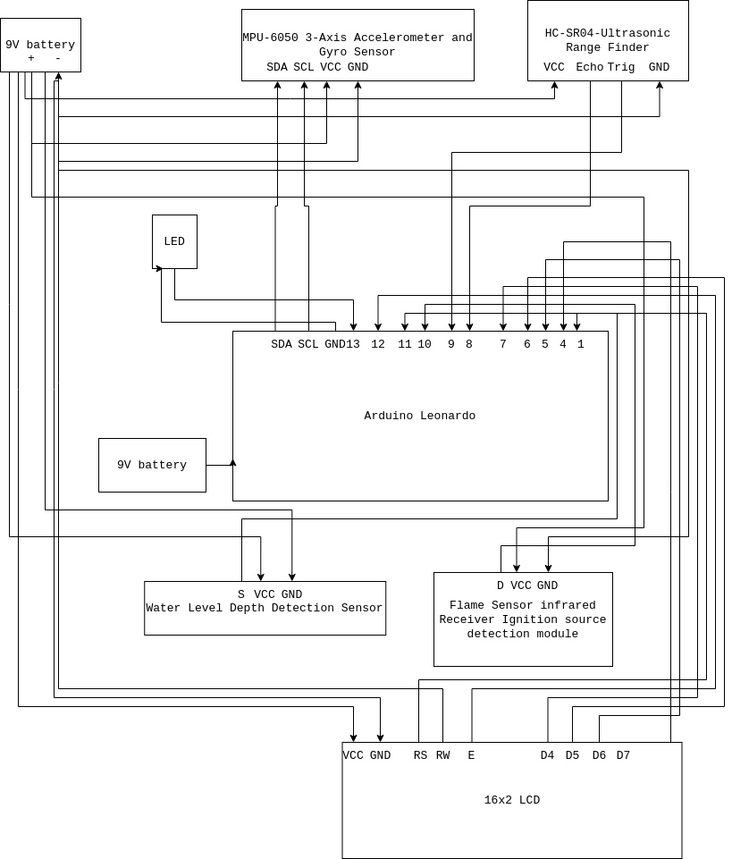

# CarSafetySystem
A Simple Arduino-based car safety system 
CONTRIBUTERS: Ashutosh, Ashutosh Routray, Claudius D'Souza

## DESCRIPTION
Our project aims to scale down and model a simple car safety ‘detection’ system using Arduino. The model comprises of four primary sensors:
1. Flame Sensor Infrared Receiver Ignition Source Detection Module 
2. Water Detection Sensor 
3. HC-SR04-Ultrasonic Range Finder 
4. MPU-6050 3-Axis Accelerometer and Gyro Sensor

## FUNCTIONS OF SENSORS:
- The Flame Sensor Module is used for Fire Detection in a car’s internal wiring.
- The Water Detection Sensor is used for detecting the seepage of flood water into the car exhaust.
- The Ultrasonic Range Finder is used as a proximity/collision detector.
- The Gyro Sensor is used to detect the physical stability and balance of a vehicle; used in falls and flip overs, works along with the collision sensor

## GENERAL WORKING:
- The sensors and the Arduino Leonardo board are powered by two segregate 9 Volt Batteries – this is to ensure sufficient power supply to all the involved components. 
- Each device when triggered according to their sensor, produces a signal that is processed and displayed onto a 16x2 LCD Monitor. This process is mediated by the programmed Arduino Leonardo board.
- The LCD Monitor can serve as a means to know the cause of the accident and the component can be rectified accordingly.
- Additionally, an LED light has been programmed to produce an SOS light; a standard emergency projection in Morse Code to display a call/request for rescue. This is especially used for spotting cars that are underwater or in the dark.
- All the above modules are placed at appropriate positions in the model that applies to a real-life vehicle.

## CIRCUIT DIAGRAM:

